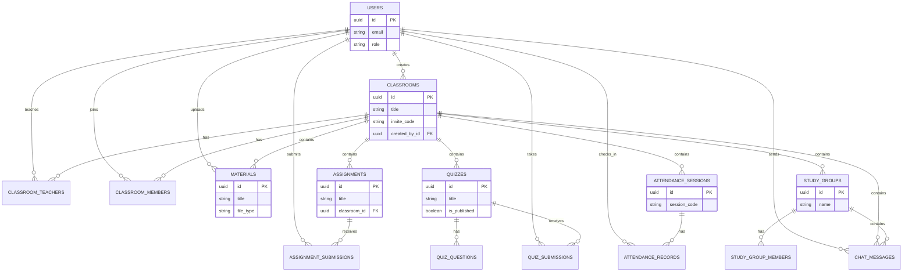

# Temar Lije - entity relationship diagram

> Reflects the deployed PostgreSQL schema (exported SQL, run locally by the
> team). Covers users, classrooms, coursework, attendance, and collaboration.

